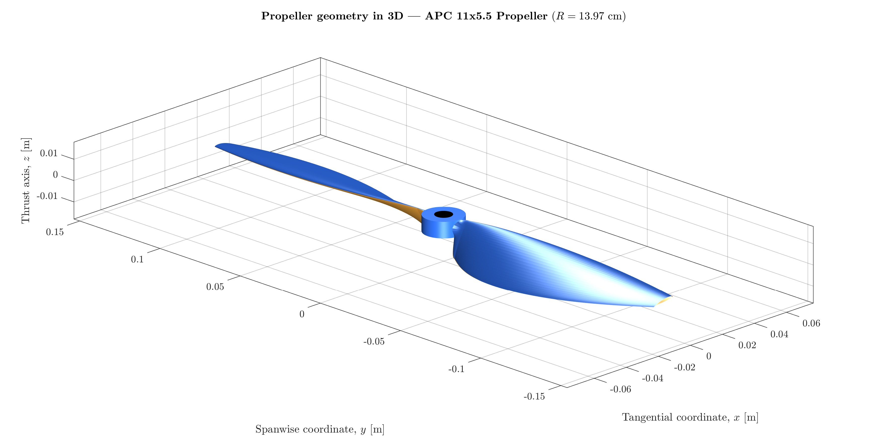
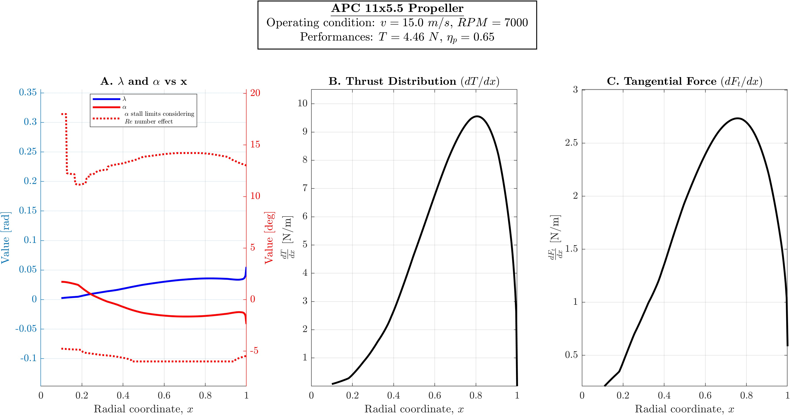
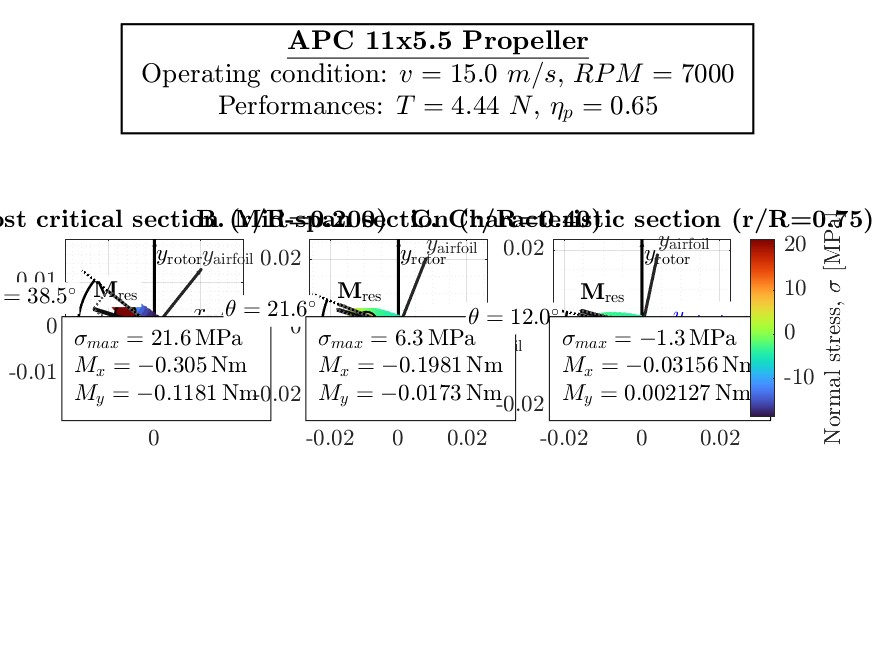
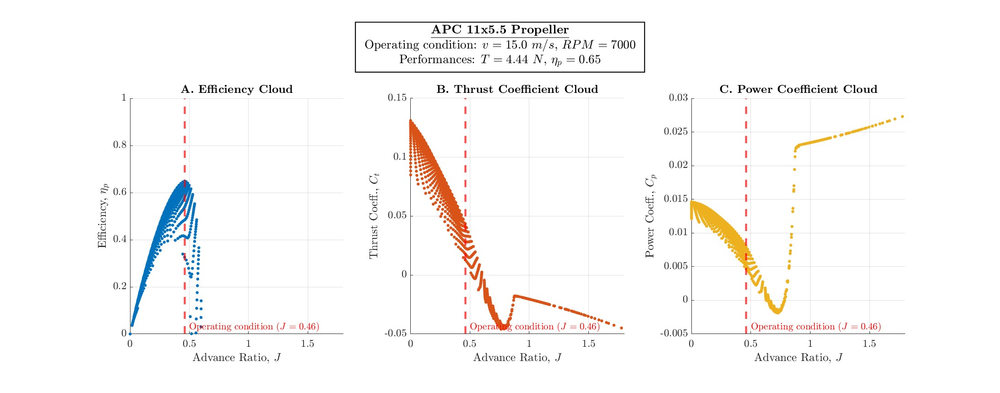

# SABEMMT: Structures And Blade Element Modified Momentum Theory

**SABEMMT** is a MATLAB-based aerodynamic and structural solver designed for the analysis and optimization of airplane propellers, helicopter rotors, and multirotor blades in axial flight.

Unlike standard BEMT codes that fail at low speeds, this project implements an "Engineering Modification" to the Momentum Theory, allowing it to robustly handle **static thrust**, **hover**, and **turbulent wake states**.

## Features

* **Robust Inflow Model**: Uses the Cuerva et al. (2006) modification to handle the "Singularity of Momentum Theory," making it stable for static thrust and vertical descent.
* **Reynolds-Aware Aerodynamics**: interpolation of $C_l$ and $C_d$ polars across varying Reynolds numbers ($Re$) along the blade span.
* **Structural Estimation**: Calculates Centrifugal Force ($F_{cf}$) and Bending Moments ($M_x, M_y$) to estimate stresses in a conservative way.
* **Vectorized Solver**: Optimized MATLAB code for fast execution, suitable for iterative design and optimization loops.
* **Visual Output**: Automatically generates plots for aerodynamic load distribution ($dT/dx, dF_t/dx$), angle of attack ($\alpha$), and structural stress.

## Project Structure

* `main_runner.m`: **Start here.** The driver script that defines the propeller geometry (Chord/Twist), loads airfoil data, and executes the simulation.
* `runSABEMMT.m`: The core BEMT solver function. It handles the iterative induction loops and structural integration.
* `getAirfoilDataMultiReE214.m`: A sample database containing Eppler E214C-PT airfoil polars (Lift/Drag vs Alpha vs Re).
* `getAirfoilInertias.m`: Function that computes the geometric characteristics of the airfoil needed for structural analysis.
* `plotGeometryAndPerformances.m`: A comprehensive plotting function that generates multiple article-ready plots.

## Theoretical Basis

This solver is based on **Blade Element Momentum Theory (BEMT)** but replaces the standard momentum equation with a continuous function that bridges the gap between the "Windmill Brake State" and "Propeller State."
For a complete mathematical derivation of the model, including the structural equations, please see the [**Technical Documentation (PDF)**](docs/The_SABEMMT_Aerodynamic_and_Structural_Model_for_Propellers.pdf).

**Reference:**
> Cuerva, A., Sanz-Andrés, A., Meseguer, J., & Espino, J. L. (2006). "An Engineering Modification of the Blade Element Momentum Equation for Vertical Descent". *Journal of the American Helicopter Society*, 51(4), 349-354.

## Usage

1.  **Clone the repository:**
    ```bash
    git clone [https://github.com/miguel-frade/sabemmt.git](https://github.com/miguel-frade/sabemmt.git)
    cd sabemmt-rotor-analysis
    ```

2.  **Open MATLAB** and navigate to the project folder.

3.  **Run the driver script:**
    ```matlab
    main_runner
    ```

4.  **Analyze the Output:**
    The script will output performance metrics to the Command Window and generate a 4-panel figure:
    * **Thrust & Torque Distribution**: Aerodynamic loading along the span.
    * **Angle of Attack**: Checks for stall relative to the airfoil limits.
    * **Structural Stress**: Estimated max stress (useful for material selection).
    * **Geometry**: Visualization of the blade's chord and twist.

## Configuration

To analyze your own propeller, modify `main_runner.m`:

* **Geometry**: Update `R` (radius), `c` (chord distribution), and `theta_deg` (twist distribution).
* **Operating Point**: Change `v` (velocity in m/s) and `rpm`.
* **Airfoil**: Replace `getAirfoilDataMultiReE214` with your own function or data structure. *Ensure your polars cover the necessary Reynolds range.*

## Example Output

For a propeller similar to the APC 11x5.5 Sport Propeller used for UAVs, numerical results and multiple plots can be found in the [results/](results/) folder.

Some example plots are:










## License

**Author:** Miguel Frade  
**Affiliation at time of publication:** Universidad Politécnica de Madrid  
**Date:** December 2025  

This project is licensed under the **Creative Commons Attribution–NonCommercial 4.0 International (CC BY-NC 4.0)** license.

The code may be used, modified, and redistributed for **academic and non-commercial purposes**.  
If this repository contributes to published research, citation of the project is appreciated.


